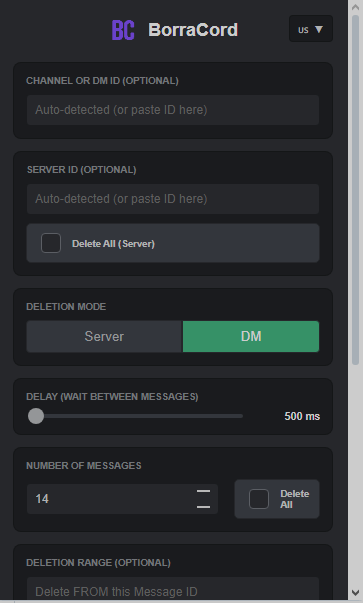

<div align="center">
  

  # BorraCord
  
  **The simple, intuitive, and powerful bulk message deleter for Discord.**
  
  Available in 6 languages.
  
  [](LICENSE)
  [](manifest.json)
  []()
  [](https://ko-fi.com/narc0tics4life)

  <br>
  
  
  
  <br><br>

  [Features](#features) • [Installation](#installation) • [Usage](#usage) • [Bug Reports & Feedback](#bug-reports--feedback) • [Disclaimer](#warning-disclaimer)
</div>

---

## 📖 About

**BorraCord** is a browser extension dedicated to bulk deletion of direct messages or server messages on Discord. It is designed to be concise, easy to use, and safe, featuring an automatic delay system to help avoid hitting Discord rate limits.

If you found the extension useful, a star is enough for me! But you can also support me on Ko-Fi if you'd like :3 🥇

## ✨ Features

Based on the latest build v0.1.0:

* **🛡️ Dual Modes:**
  * **Server Mode:** Delete messages in a specific channel or iterate through **all channels** in a server to wipe everything.
  * **DM Mode:** Clean up your private Direct Messages history.
* **🎯 Precision Deletion:**
  * **Range Deletion:** Specify `From ID` and `Until ID` to delete a specific segment of chat history.
  * **Count Limit:** Choose exactly how many messages to delete (e.g., last 50).
  * **Smart Sorting:** Delete in Ascending or Descending order.
* **🌍 Multi-language Support:**
  * 🇺🇸 English
  * 🇪🇸 Español
  * 🇵🇹 Português
  * 🇫🇷 Français
  * 🇯🇵 日本語
  * 🇩🇪 Deutsch
* **⚡ Auto-Detection:** Automatically grabs Channel and Guild IDs from your active Discord tab.
* **⚙️ Safety Controls:** Adjustable delay slider (500ms - 5000ms) to help prevent Discord API timeouts.

## 🚀 Installation

Since this is a developer extension, you can install it via "Load Unpacked" mode:

1. **Download** or **Clone** this repository to your computer.
2. Open your browser (Chrome, Edge, Brave) and navigate to `chrome://extensions`.
3. Enable **Developer Mode** (toggle in the top right corner).
4. Click **Load Unpacked** (top left).
5. Select the folder where you saved **BorraCord**.
6. That's it! The icon should appear in your toolbar.

## 🛠️ Usage

1. Open **https://discord.com/app** in your browser.
2. Navigate to the DM or Server Channel you want to clean.
3. Click the **BorraCord** extension icon.
4. **Configure your deletion:**
   * *Optional:* The IDs are auto-detected, but you can paste specific ones manually.
   * Select **Mode** (Server or DM).
   * Set the **Number of messages** or check "Delete All".
5. Click **Start Deletion**.
6. Monitor progress in the status bar or the "Errors" console within the popup.

## 🐛 Bug Reports & Feedback

**BorraCord** is currently in **v0.1.0**. Since this is an early release, you might encounter some bugs or edge cases depending on your browser or Discord updates.

If you find a bug, please help us improve by reporting it in the **[GitHub Issues](https://github.com/narc0tics4life/BorraCord/issues)** tab.

### How to report a bug effectively:

```text
  Describe the bug
A clear and concise description of what the bug is

  To Reproduce
Steps to reproduce the behavior:
1. Go to '...'
2. Click on '...'
3. Scroll down to '...'
4. See error

  Expected behavior
A clear and concise description of what you expected to happen.

  Screenshots / Console Errors
If applicable, add screenshots or copy the error log from the extension popup (click "Copy" in the Errors section).

  Environment:
 - OS: [e.g. Windows 10, macOS]
 - Browser: [e.g. Chrome 98, Brave, Opera GX]
```

## ⚠️ Disclaimer

> **PLEASE READ CAREFULLY**

This tool automates user actions on Discord. While BorraCord includes safety delays, **automating user accounts (Self-Botting) is technically against Discord's Terms of Service**.

* **Use at your own risk.** The author is not responsible for any bans or account suspensions resulting from the use of this tool.
* Do not set the delay too low (recommended: keep it above 1000ms).
* This tool is intended for managing your own data and privacy.

## 📄 License

Distributed under the **MIT License**. See [LICENSE](LICENSE) for more information.

---

<div align="center">
  Made with floppa by 🐱 <a href="https://github.com/narc0tics4life">narc0tics4life</a>
</div>
